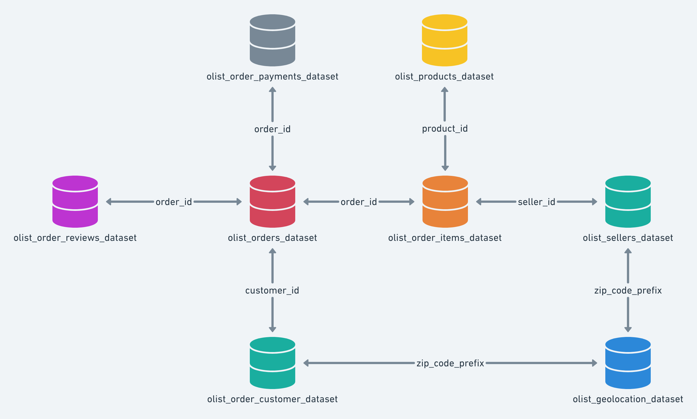

# ProjetDataMining

Ce dépôt contient le code et le rapport du travail réalisé dans le cadre du projet de Data Mining à l'Univeristé Claude Bernard Lyon 1.

## Jeu de données choisi Olist Brazilian e-commerce

Ce jeu de données a été rendu disponible par l'entreprise brésilienne Olist Store. Il renferme des informations sur 100000 commandes effectuées entre 2016 et 2018 au niveau de divers marché au Brésil. Il s'agit de données commerciales réelles anonymisées et les références aux entreprises et partenaires ont été remplacé par du texte de Game of Thrones. Il contient des informations sur les clients et leur localisation. Il peut être utilisé pour identifier les clients dans l'ensemble des commandes ainsi que leur livraison. 
Les schéma du jeu de données est le suivant:

##  Approches

**Membres du groupe**: COLMANT Axel, SENE Mohamed Massamba, MUNOZ Matéo

Nous allons approcher le jeu de données de trois manière différente:
- Clustering pour trouver des segments clients (définir les différents types de clients), en se basant sur les données des commandes clients par Massamba
- Recommendation / factorisation de matrice pour les produits, en se basant sur les données des avis clients réalisé par Matéo
- Méthodes d'analyse basées sur les graphes pour extraire des informations supplémentaires à partir des relations entre les différentes entités du jeu de données par Axel

